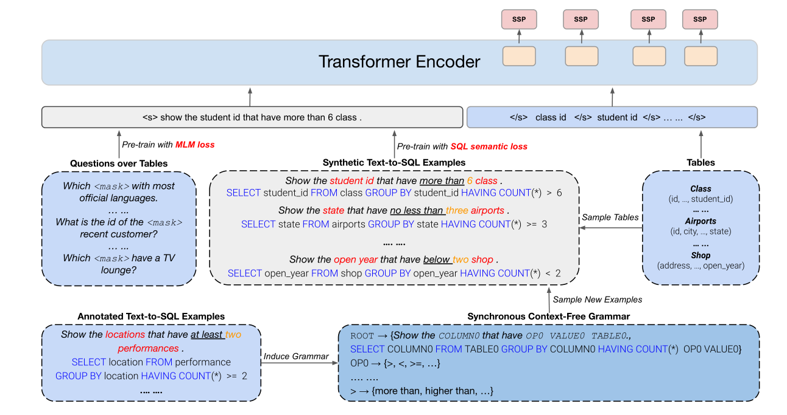

## GRAPPA

### 摘要

提出一种有效的预训练任务，与语义解析器结合时在四个流行的任务上获得了SOTA

### 介绍

 

 

text-to-sql例子是现有的，从现有的例子中抽象出一个模板。

使用现有的模板随机生成question-SQL例子，使用qS例子和它相应的表去训练模型

### 方法论

大量研究表示上下文无关语法分割有效

#### 同步上下文无关语法的数据合成

预训练任务--让BERT识别可替换的部分并学习底层逻辑模板

