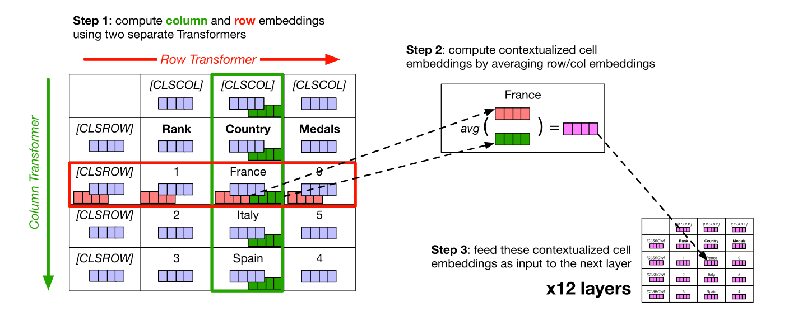
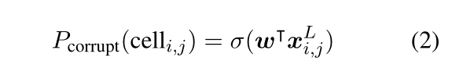
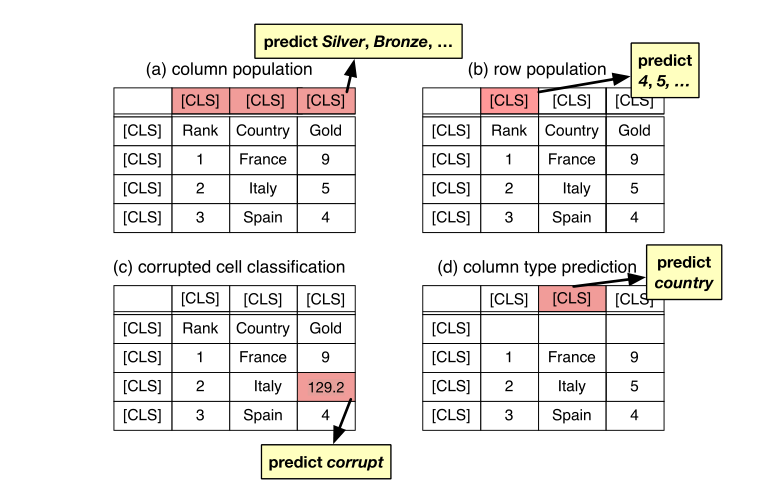

## TABBIE

### 摘要

现存在表格上表示学习的工作通常使用表和相关文本进行子监督学习（如BERT）

这些工作提高一些模型的性能（包含表-文本对的任务），但是在那些不包含相关文本的下游任务中，它表现不佳

本文设计了一种简单的预训练方式（损坏单元检测），提供了所有表结构的嵌入，更少训练时间，更少计算

分析表明本模型能理解复杂的表语义和数值趋势

### 介绍

许多实际问题中涉及表格数据的语义理解，但并不需要额外的文本输入，引出模型。

BERT的训练方式，将表数据与相关文本concatenate，过于昂贵，需要截断

TABBIE的结构基于两个分别编码行和列的Transformers，在每层池化。

### 模型

TABBIE使用一个MxN的表作为输入，得到每一个格子的嵌入

#### 初始化

1. 使用BERT初始化cell，输入内容，得到[CLS]输出，再加上相应的位置嵌入得到初始化xij（i行j列）。

2. 因为xij，是单独通过BERT初始化的，所以要融入上下文信息，把xi1,xi2,...,xin输入行transformers得到ri1,ri2,...rin，列同理得到c1j,c2j,...,cnj

3. 每一层对rij和cij做平均，作为下一层的输入

4. 通过添加[CLSROW]和[CLSCOL]实现对整行和整列表示的提取

    

#### 预训练

损坏细胞检测这种预训练方式是表结构分解中的一项基本任务，所以比较契合（？

  

最终层使用w * xij加激活函数的方式判断一个细胞是否损坏

损失函数是二元交叉熵

#### 实验

通过三个下游任务来判断

 

列预测、行预测、列类型

都表示优于TaBert

#### 结论

提出了一种新的预训练方式，表现优于TaBert，定性分析好