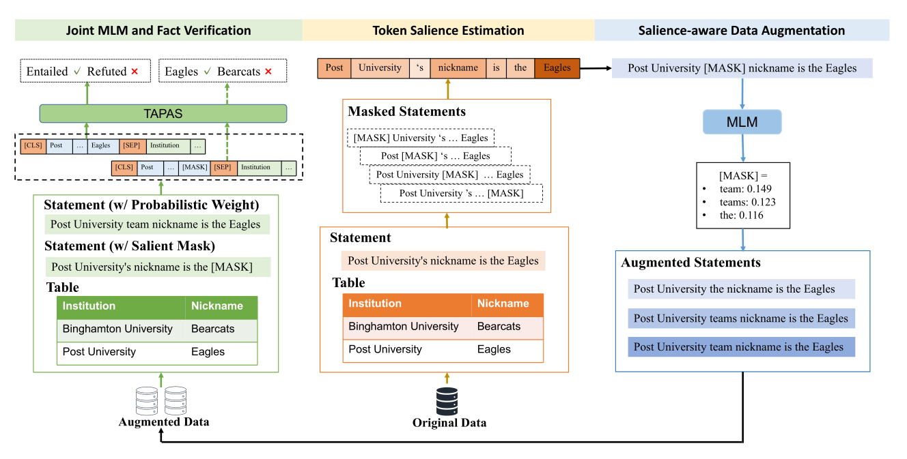
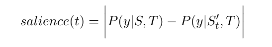

## Table-based Fact Verification with Salience-aware Learning

### 摘要

尽管在表格事实检测方面已经有了很多工作，但表格数据和tokens的对齐很少被考虑到。

基于反事实因果关系的启发，本系统在陈述中识别token级别的显著关系

### 介绍

表格可以被用来验证文本陈述事实，但要利用它必须要知道表中哪些信息是相关的，并根据相关信息进行推理。之前的研究试图生成逻辑程序来获取逻辑操作以及语句和表之间的关系，但是最近的研究表明基于Transformers的语言模型可以不依赖与显式逻辑程序。（看到这里有点困了，胡言乱语）

主要贡献：

1. 提出了一种基于探针的方式去评估每个token的重要性，基于反事实因果理论
2. 提出了一种可学习的salience-aware系统来提高事实检测模型
3. 引入了一种由不显著的tokens驱动的概率数据增强方式

### 模型

 

使用TAPAS为序列做初始化，再接MLP作二分类

##### 基于探针的显著token估计

反事实因果关系的简单理解：

如果没有这个token，它还会做出同样的预测吗？（如果不会，则该token很重要）

 

给出表T和陈述S以及mask了token的S‘

##### 掩蔽显著token预测

考虑到在事实检测任务上的监督信号稀少并且可能不够充分，引入掩蔽显著令牌预测作为一个辅助任务：

###### **给定掩码过最显著token的陈述和相应表格，去预测一个掩码显著令牌token**

辅助任务的参数更新会被主任务共享

##### 显著感知数据增强

把陈述中最不显著的token掩码掉，使用K个最大可能的token去替换他，得到了k个例子

my name is houlei ->>> my name [] houlei 

my name isn't houlei (eg)

#### 实验结果

后面看

